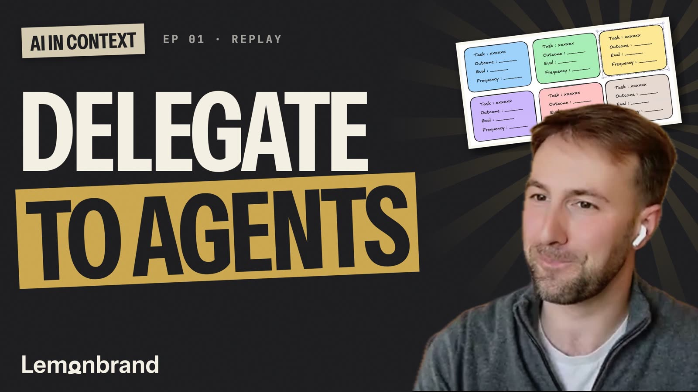
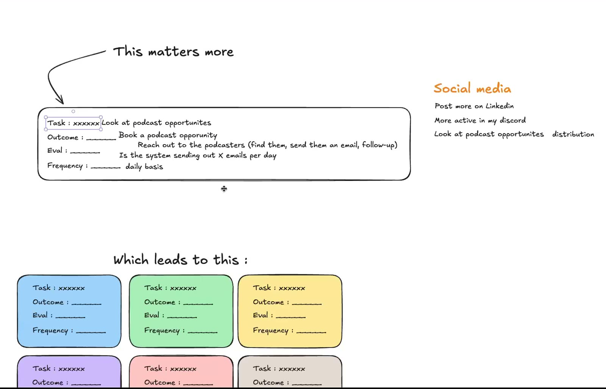
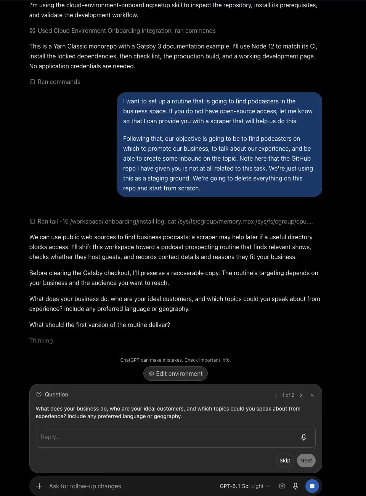
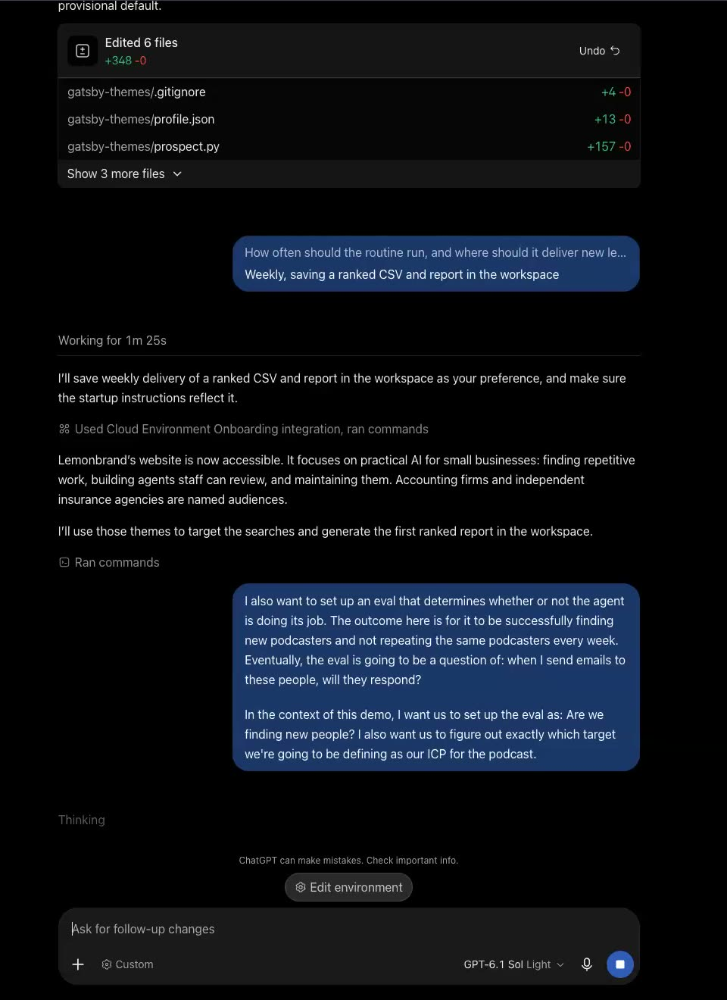
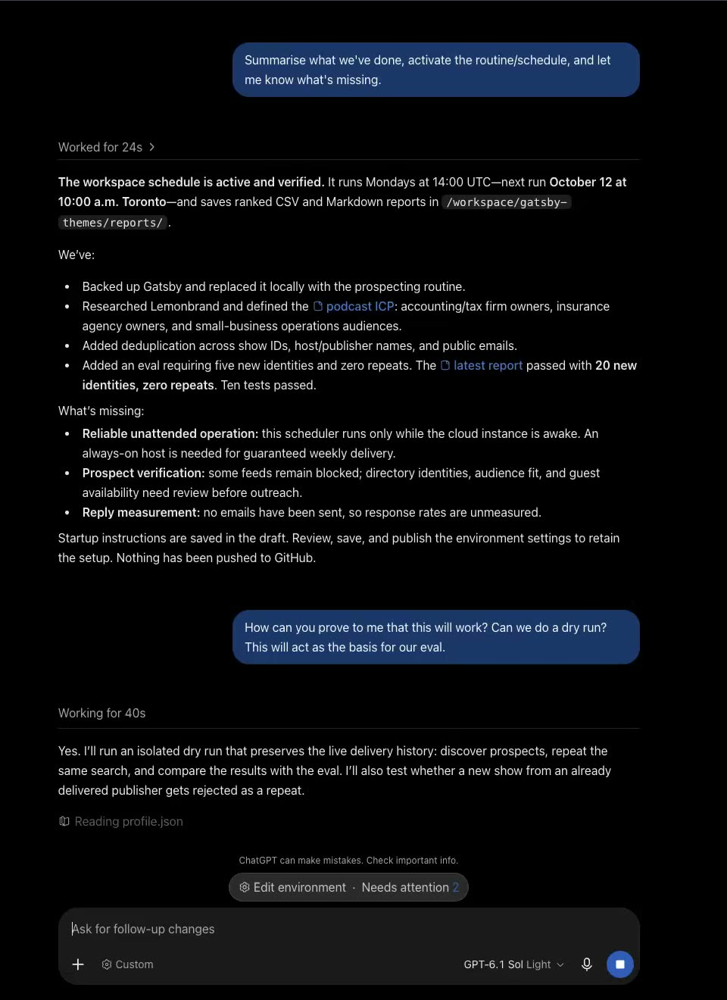

# Ep 01: Delegating to agents

[](https://youtu.be/G45VTbDvHFc?t=869)

This folder is the agent I built live in [AI in Context](../README.md) Ep 01, on October 8, 2026. I gave a Codex cloud agent one task: find podcasts I could go on to talk about my business. The code in here was written by the agent during the session. I steered it with five messages, listed below.

The point of the session wasn't the podcast finder. It was the method:

> my objective is really just to come up with a task, with the outcome, with the eval, and with the frequency.

> I know that the first version is going to be the worst version of the agent.

## Watch it

Full replay: https://youtu.be/G45VTbDvHFc

The demo starts at [14:29](https://youtu.be/G45VTbDvHFc?t=869). Jump points:

| Replay time | What happens |
|---|---|
| [13:51](https://youtu.be/G45VTbDvHFc?t=831) | "GitHub seems really complicated. It's really, it's just a ledger." |
| [14:29](https://youtu.be/G45VTbDvHFc?t=869) | Connecting GitHub in Codex and picking this repo |
| [15:20](https://youtu.be/G45VTbDvHFc?t=920) | The task prompt |
| [16:35](https://youtu.be/G45VTbDvHFc?t=995) | Task, outcome, eval, frequency |
| [20:02](https://youtu.be/G45VTbDvHFc?t=1202) | The first version is going to be the worst version |
| [27:31](https://youtu.be/G45VTbDvHFc?t=1651) | Adding the eval |
| [40:29](https://youtu.be/G45VTbDvHFc?t=2429) | "How can you prove to me that this will work? Can we do a dry run?" |

Next session: https://lemonbrand.io/next/gh-ep01. All sessions and replays: https://lemonbrand.io/live

## The method



Before touching the agent I wrote the job down in four lines. Task: look at podcast opportunities. Outcome: book a podcast. Eval: is the system sending out X emails per day. Frequency: daily. One agent per box. For the demo we narrowed it to a weekly run with one eval: are we finding new people?

## The prompts, in order

These are the messages I sent the agent, as they appear on screen in the replay.

1. The task:

   > I want to set up a routine that is going to find podcasters in the business space. If you do not have open-source access, let me know so that I can provide you with a scraper that will help us do this.
   >
   > Following that, our objective is going to be to find podcasters on which to promote our business, to talk about our experience, and be able to create some inbound on the topic. Note here that the GitHub repo I have given you is not at all related to this task. We're just using this as a staging ground. We're going to delete everything on this repo and start from scratch.

   

2. Answers to the agent's questions: "Lemonbrand is my business, go check out lemonbrand.io", "A scheduled prospecting routine with new leads delivered regularly", then "Weekly, saving a ranked CSV and report in the workspace".

3. The eval:

   > I also want to set up an eval that determines whether or not the agent is doing its job. The outcome here is for it to be successfully finding new podcasters and not repeating the same podcasters every week. Eventually, the eval is going to be a question of: when I send emails to these people, will they respond?
   >
   > In the context of this demo, I want us to set up the eval as: Are we finding new people? I also want us to figure out exactly which target we're going to be defining as our ICP for the podcast.

   

4. "Summarise what we've done, activate the routine/schedule, and let me know what's missing."

5. "How can you prove to me that this will work? Can we do a dry run? This will act as the basis for our eval."

   

## What the agent built

A weekly podcast prospector. It searches Apple's public podcast directory, reads each show's public RSS feed, scores the shows against a business profile, and writes a ranked report. It remembers who it already delivered, so next week's list only has new people. It never sends email.

| File | What it does |
|---|---|
| [`profile.json`](profile.json) | The business profile: search terms, fit keywords, country, how many leads a week, how many must be new. Edit this for your business. |
| [`ICP.md`](ICP.md) | Who the podcasts are for, who to skip, and how the eval is defined. |
| [`prospect.py`](prospect.py) | The agent's routine. Searches, reads feeds, scores, skips repeats, writes `reports/<time>.csv`, `.md` and `.json`, and updates `state/delivered.json`. |
| [`evaluate.py`](evaluate.py) | The eval, run on its own. Compares a report with every earlier report. Passes only with at least 5 new hosts or publishers and zero repeats. |
| [`dry_run.py`](dry_run.py) | The proof. Takes one live snapshot of the sources, then replays three simulated weeks in a separate folder and checks the mechanics. |
| [`schedule.py`](schedule.py) | Runs `prospect.py` every Monday at 14:00 UTC while the machine is on. Catches up a missed week and retries failures after an hour. |
| [`test_prospect.py`](test_prospect.py) | 10 unit tests. No network. |

## Run it

You need Python 3.12 or newer. No packages, no API keys.

```sh
cd ep01-delegating-to-agents
python -m unittest -q          # 10 tests, offline
python prospect.py             # one live run, writes reports/ and state/
python evaluate.py reports/<timestamp>.json --history reports
python dry_run.py              # live snapshot + three simulated weeks in dry-runs/
```

`evaluate.py` exits 0 on a pass and 1 on a fail. A first run is a baseline against empty history, so it says nothing about repeats yet. Run it again next week and it gets interesting.

To make it yours, edit `profile.json`. Change the business, the search terms and the keywords. `positioning_verified` has to be `true` before it will run; that is there so you read the profile before you schedule it.

Keep `reports/` and `state/` between runs. They are the agent's memory. If you delete them it will happily deliver the same people again, and the eval has nothing to compare against. Both folders are in `.gitignore`, so prospect data never lands in a public repo.

### Weekly runs

On a machine that stays on:

```sh
mkdir -p state
nohup python -u schedule.py >> state/scheduler.log 2>&1 < /dev/null &
```

It only runs while the machine is awake, and it has to be restarted after a reboot.

There is also an optional GitHub Actions workflow, [`ep01-weekly-prospecting.yml`](../.github/workflows/ep01-weekly-prospecting.yml). It is off unless you set the repository variable `ENABLE_PUBLIC_PROSPECTING=true`. Read it first: it stores reports as Actions artifacts, and in a public repo other people can download those.

## What the dry run showed

During the session the dry run delivered 20 new hosts, then 17 more, then zero once the captured pool ran out. No repeats. A second run in the same week was skipped. The empty week correctly failed the eval. A fake new show from a publisher it had already delivered was caught as a repeat.

## Limits

The agent wrote most of these itself.

- A host or publisher name is a stand-in for a person, not proof of one. Aliases slip through. A shared publisher can hide two different hosts.
- A keyword match is a clue, not proof the audience fits. Check the first 20 by hand.
- "Interview with" in an episode title does not mean the show takes pitches.
- Some feeds block requests. Those rows stay unverified.
- Reply rate is not measured yet. Nothing gets sent.

Next steps, if you want to take it further: real host identities, a better audience-fit check, more sources when the directory runs dry, and reply and booking numbers once outreach starts. That last one is the real eval.
